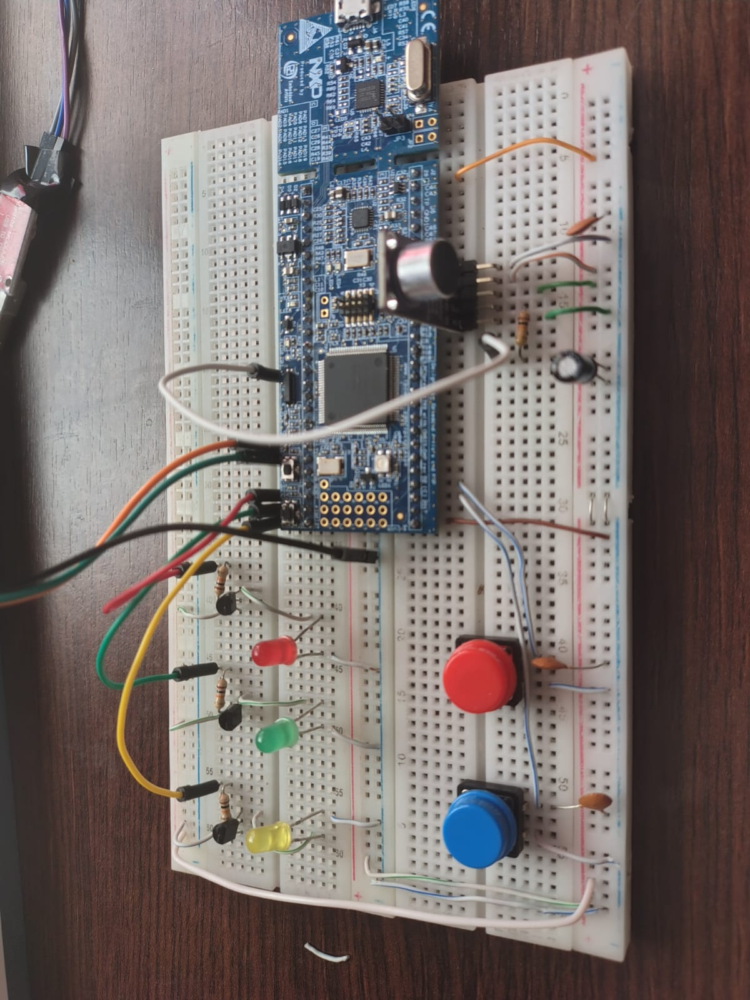
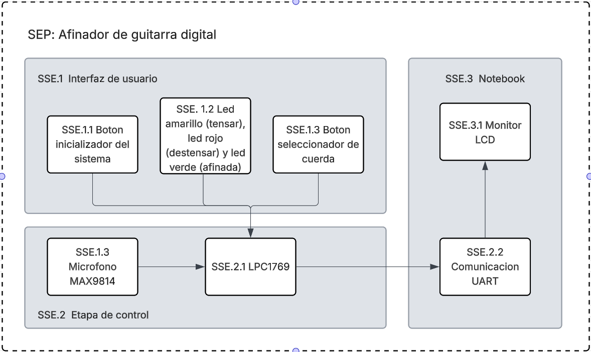

# 🎸 Afinador de Guitarra Digital (LPC1769) - *Digital Guitar Tuner (LPC1769)*



## Descripción del Proyecto

Este proyecto implementa un afinador de guitarra digital utilizando el microcontrolador NXP LPC1769 (ARM Cortex-M3) en el marco de Trabajo Final Integrador de la materia Electrónica Digital III de la carrera Ingeniería en Computación.
El sistema se encarga de :
1. Capturar la señal de audio de un micrófono preamplificado (MAX9814).
2. Muestrear la seañl analógica a digital (ADC) en tiempo real.
3. Aplicar algoritmos de procesamiento digital de señales (DSP) para la estimación de la frecuencia fundamental.
4. Proporcionar retroalimentación visual al usuario a través de LEDs y comunicación de datos estructurada vía UART para una Interfaz Gráfica de Usuario (GUI) externa.

## Project Description
*This project implements a digital guitar tuner using the NXP LPC1769 microcontroller (ARM Cortex-M3). The system is responsible for:*

1. *Capturing the audio signal from a pre-amplified microphone (MAX9814).*
2. *Sampling the analog signal into digital data (ADC) in real-time.*
3. *Applying Digital Signal Processing (DSP) algorithms for fundamental frequency estimation.*
4. *Providing visual feedback to the user via LEDs and structured data communication via UART for an external Graphical User Interface (GUI).*



### Módulo de adquisición (MAX9814)
La señal acústica es captada por un micrófono electret preamplificado (MAX9814). Para este proyecto, el modúlo se configuró especificamente para la admquisición de instrumentos de cuerda:
- Ganancia mínima (40dB) para evitar saturación del ADC.
- Ratio A/R (Ataque/Liberación) rápido (1:500) para manejar los picos iniciales de la pulsación de la cuerda y recuperar la ganancia dirante el sostenido de la nota.
- Salida analógica centrda en 1.23V para adecuarse al rango de entrada del ADC del LPC1769.

## Acquisition Module (MAX9814)
*The acoustic signal is captured by an electret microphone with a pre-amplifier (MAX9814). For this project, the module was specifically configured for string instrument acquisition:*
- *Gain: Minimum (40 dB) to prevent ADC saturation (GAIN Pin connected to VDD).*
- *A/R Ratio (Attack/Release): Fast (1:500) to handle the initial peaks of the string pluck and recover gain during the note's sustain (A/R Pin connected to GND).*
- *Analog Output: Centered at 1.23 V to suit the LPC1769 ADC's input range.*

---

## Características Clave

* **Muestreo en tiempo real:** Tasa de muestreo precisa de 20 kHz (Timer0 a 50 µs) para capturar armónicos de hasta 10 kHz sin aliasing.
* **Adquisición eficiente (DMA):** Uso de DMA con Lista Enlazada (LLI) y doble buffer (ping-pong) para la adquisición continua de muestras del ADC a SRAM sin intervención de la CPU, optimizando el rendimiento.
* **Calibración automática:** Rutina de calibración al inicio para determinar el **offset DC** del micrófono y el **umbral de ruido** de fondo ($\sigma$).
* **Estimación de frecuencia:** 
    * **Filtros digitales:** Implementación en punto fijo de un HPF ($\alpha \approx 0.99$, $f_c \approx 32$ Hz) para eliminar el offset residual, y un LPF ($\beta \approx 0.7$, $f_c \approx 1371$ Hz) para suavizar la señal y atenuar armónicos superiores.
    * **Detección de cruces por cero (Zero-Crossing):** El algoritmo calcula el periodo fundamental promediando la distancia entre múltiples cruces por cero válidos en el buffer.
    * **Doble promediado:** Se utiliza un promedio de período dentro del lote de muestras y un promedio posterior en el main loop para garantizar una lectura extremadamente estable.
* **Interfaz Visual y Serial:**
    * **LEDs:** Indica el estado de afinación (TENSAR, OK, DESTENSAR).
    * **UART:** Envía información estructurada (`freq=XXX;state=YYY;string=Z\r\n`) para la comunicación con una GUI.

## *Key Features*
- ***Real-Time Sampling:*** *Precise sampling rate of 20 kHz (Timer0 at 50 µs) to capture harmonics up to 10 kHz without aliasing.*
- ***Efficient Acquisition (DMA):*** *Use of DMA with Linked List Item (LLI) and ping-pong dual buffering for continuous ADC to SRAM sample acquisition without CPU intervention, optimizing performance.*
- ***Automatic Calibration:*** *Startup routine (triggered by EINT0) that calculates the DC offset and noise threshold ($\sigma$) to center the signal and filter ambient noise.*
- ***Robust Frequency Estimation:** *
    * ***Digital Filters:*** *Fixed-point implementation of an HPF ($\alpha \approx 0.99$, $f_c \approx 32$ Hz) to remove residual offset, and an LPF ($\beta \approx 0.7$, $f_c \approx 1371$ Hz) to smooth the signal and attenuate higher harmonics.*
    * ***Zero-Crossing Detection:*** *The algorithm calculates the fundamental period by averaging the distance between multiple valid zero-crossings within the sample buffer.*
    * ***Double Averaging:*** *Both period averaging within the sample batch and subsequent averaging in the main loop are used to ensure an extremely stable final reading.*
---

## Implementación técnica (Hardware)

| Periférico | Función | Pin | Configuración |
| :--- | :--- | :--- | :--- |
| **ADC** | Entrada de Audio/Micrófono | P0.23 (AD0.0) | Disparado por Timer0 Match 1 (20 kHz) |
| **Timer0** | Generación de Frecuencia | MAT0.1 | Período de 50 us |
| **GPDMA** | Transferencia de Datos | Canal 0 | Periférico a Memoria (ADC $\to$ SRAM), LLI Dual Buffer |
| **UART0** | Comunicación Serial | P0.2 (TXD0), P0.3 (RXD0) | Envío de estado de afinación |
| **EINT0** | Control de Inicio | P2.10 | Activa/Desactiva el sistema y modo Calibración |
| **EINT1** | Selección de Cuerda | P2.11 | Cicla a través de las 6 cuerdas |
| **GPIO (LED)** | Indicador de Estado | P0.27 (Rojo), P0.28 (Verde), P2.13 (Amarillo) | Retroalimentación de afinación |

## *Technical Implementation (Hardware)*
*The system uses the LPC1769's internal pull-up resistors for the input pins (EINT0/EINT1).*
| Peripheral | Function | Pin | Configuration |
| :--- | :--- | :--- | :--- |
| **ADC** | Audio/Microphone Input | P0.23 (AD0.0) | Triggered by Timer0 Match 1 (20 kHz) |
| **Timer0** | Frequency Generation | MAT0.1 | Period of 50 µs |
| **GPDMA** | Data Transfer | Channel 0 | Peripheral to Memory (ADC → SRAM), LLI Dual Buffer |
| **UART0** | Serial Communication | P0.2 (TXD0), P0.3 (RXD0) | Sends tuner state |
| **EINT0** | Start Control | P2.10 | Activates/Deactivates the system and Calibration mode |
| **EINT1** | String Selection | P2.11 | Cycles through the 6 strings |
| **GPIO (LED)** | Status Indicator | P0.27 (Red), P0.28 (Green), P2.13 (Yellow) | Tuning feedback |


### Frecuencias objetivo - Calibrated Target Frequencies
Las frecuencias objetivo estan ajustadas en base a mediciones reales del sistema usando un afinador comercial de referencia, compensando el efecto armónico complejo de la guitarra y la respuesta del AGC.

*Target frequencies are tuned based on real-world measurements of the system (SEP/MAX9814) using a commercial reference tuner, compensating for the guitar's complex harmonic effect and the AGC response.*


| Índice (curr\_string) | Cuerda | Frecuencia Objetivo (Hz) |
| :--- | :--- | :--- |
| 0 | Mi (E) - Aguda | 342 Hz |
| 1 | Si (B) | 280 Hz |
| 2 | Sol (G) | 209 Hz |
| 3 | Re (D) | 165 Hz |
| 4 | La (A) | 147 Hz |
| 5 | Mi (E) - Grave | 202 Hz |

---

## Instrucciones de uso

### 1. Requisitos de Hardware Adicionales - *Additional Hardware Requirements*
* Placa de desarrollo LPC1769 - *LPC1769 development board.*
* Micrófono MAX9814 configurado. -*Configured MAX9814 Microphone.*
* Dos pulsadores conectados a P2.10 (EINT0) y P2.11 (EINT1), ambos con un capacitor de 100nF para antirrebote. - *Two push buttons connected to P2.10 (EINT0) and P2.11 (EINT1), both with a 100nF capacitor for debouncing.*
* Un conversor USB-TTL (ej. FTDI o CP2102) para la comunicación UART. - *A USB-TTL converter (e.g., FTDI or CP2102) for UART communication.*

### 2. Requisitos de Compilación 

* Entorno de desarrollo **MCUXpresso IDE** - *Development environment **MCUXpresso IDE**.*
* Herramientas de compilación **`arm-none-eabi-gcc`** (Toolchain) - *Build tools **`arm-none-eabi-gcc`** (toolchain).*
* Librerías **CMSISv2p00\_LPC17xx** (Ya incluidas en la configuración del proyecto) - *Libraries **CMSISv2p00\_LPC17xx** (Already included in the project configuration).*

### 3. Ejecución - *Execution*

1.  **Cargar el Código - *Load the Code:*** Compila y carga el archivo `main.axf` en la placa LPC1769 - *Compile and upload the `main.axf` file to the LPC1769 board.*
2.  **Conectar UART - *Connect UART:*** Conecta el conversor USB-TTL a UART0 (P0.2/P0.3) y ábrelo en una terminal serial a 9600 baudios, 8N1 en tu PC - *Connect the USB‑TTL converter to UART0 (P0.2/P0.3) and open it in a serial terminal at 9600 baud, 8N1 on your PC.*

3.  **Iniciar Calibración - Start Calibration:** Presiona el botón conectado a **EINT0 (P2.10)** en un ambiente de silencio. Esto inicia el sistema y entra en el modo de calibración - *Press the button connected to **EINT0 (P2.10)** in a quiet environment. This starts the system and enters calibration mode.*

3.  **Afinación** - ***Tuning:***

    * **Seleccionar Cuerda - *Select String:*:** Pulsa el botón conectado a **EINT1 (P2.11)** para ciclar a través de las 6 cuerdas - *Press the button connected to **EINT1 (P2.11)** to cycle through the 6 strings.*
    * **Afinar - *Tune*:** Toca la cuerda que desees afinar. Observa los LEDs - *Pluck the string you want to tune. Observe the LEDs:*
        * **🟢 Verde - Green:** Afinado (Dentro de $15$ Hz del objetivo) - *In tune (within 15 Hz of the target).*
        * **🟡 Amarillo - Yellow:** Demasiado bajo (TENSAR) - *Too low (TIGHTEN).*
        * **🔴 Rojo - Red:** Demasiado alto (DESTENSAR) - *Too high (LOOSEN).*
4.  **Monitoreo - *Monitoring:*** Conecta un terminal serial (9600 baudios, 8N1) a **UART0 (P0.2/P0.3)** para visualizar los mensajes de estado - *Connect a serial terminal (9600 baud, 8N1) to **UART0 (P0.2/P0.3)** to view status messages:*
    ```
    freq=215;state=TENSAR;string=2
    freq=222;state=OK;string=2
    ```

### 3. Vizualizacion en la GUI - *GUI Visualization*
La GUI requiere el módulo pyserial para comunicarse con la placa. Abre tu terminal o símbolo del sistema e instala pyserial:

*The GUI requires the pyserial module to communicate with the board. Open your terminal or command prompt and install pyserial:*

    pip install pyserial

Ejecutas la GUI desde la carpeta actual donde se encuentra tuner_gui.py de la siguiente forma:

*Run the GUI from the folder where tuner_gui.py is located as follows:*

    python tuner_gui.py


## Integrantes del grupo - *Members*
* Molina, María Wanda
* Sabena, Maria Pilar
* Verdú, Melisa Noel